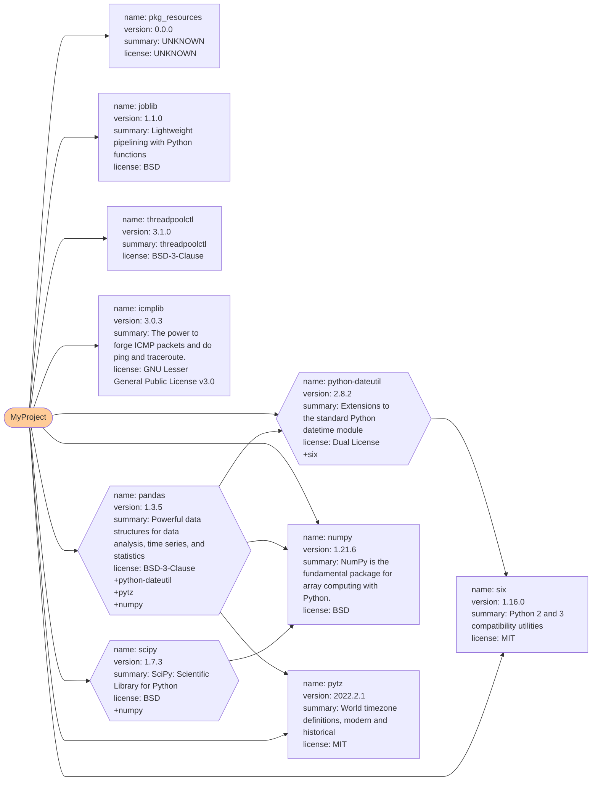

# Dynamic Pip


_Photo by David Dibert: https://www.pexels.com/photo/green-and-gray-evergreen-cargo-ship-1117210/_

Help users to dynamically manage python package resources and bid farewell to the constraints of the `requirements.txt` file.

<p align="center">
    
    
</p>


## Build-in `pip`

Refer: https://pip.pypa.io/en/stable/cli/pip_install/

## Dynamic-Pip

Through `DynamicPip` class object, dynamically manage (install, delete, etc.) python packages during the execution of the program. In addition, compared to build-in `pip`, `dynamic-pip` also supports some extended functions.

Example: Install the `numpy` package at runtime

```py
from dynamicPip import DynamicPip

dynamic_pip = DynamicPip()

# declare target package
target_package = 'numpy==1.21.6'

# install
print(f'----- install {target_package} test -----')
rtn = dynamic_pip.install_package(target_package)
print(f'return result code {rtn}\n')

# check package list
print(f'----- list {target_package} test -----')
rtn = DynamicPip.list_package()
print(f'return result {rtn}\n')

# uninstall single package
print(f'----- uninstall {target_package} test -----')
rtn = DynamicPip.remove_package(target_package)
print(f'return result code {rtn}\n')

del dynamic_pip
```

Example: Build a requirement map
```python
from dynamicPip import DynamicPip

dynamic_pip = DynamicPip()

dynamic_pip.generate_requires_map()
```

Example: List all installed packages. (`pip list`)
```python
# check package as dict. (key = package name, value = version )
rtn = dynamic_pip.list_package()
print(f'return result {rtn}\n')
```

Example: Generate a requirement map
```python
dynamic_pip.generate_requires_map(target_output_requirements__map_file_name)
```



## Features :point_left:
- [x] support install / uninstall specific package(s) at runtime
- [x] install / uninstall from the given requirements file
- [x] support python test unit
- [x] support multiple index-url, auto-detect fastest PyPI mirror
- [x] support extra-index-url
- [x] export requirements file
- [x] build requires map
- [x] install from local file
- [x] find package exist

## Limitations :construction:
- [ ] official `inspect` function is still in the experimental stage.
- [ ] official `--dry-run` function is still in the experimental stage.
- [ ] official `--report` function is still in the experimental stage.

## Future version
- [ ] generate a report about all installed packages
- [ ] verify hash
- [ ] dynamic `import`
