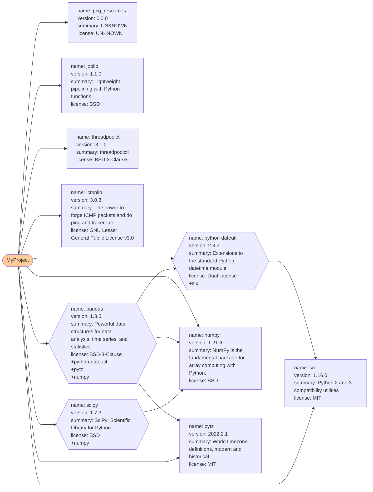

# Dependency tree

Dependencies between `packages` are a challenge in `python`. `dynamic-Pip` can automatically mine the interdependencies between `packages` and visualize them in a `tree` way.

The following example will generate a `Markdown` file named `test_req_map.md`, which contains the dependencies of all installed `packages`.
```python
target_requirements_file_name = './test_req.txt'
target_requirements__map_file_name = './test_req_map.md'

from dynamicPip import DynamicPip

dynamic_pip = DynamicPip()

# install
print(f'----- install from requirements file test -----')
rtn = dynamic_pip.install_from_requirements_file(target_requirements_file_name)
print(f'return result code {rtn}\n')
self.assertTrue(0 == rtn)

dynamic_pip.generate_requires_map(target_requirements__map_file_name)
```

The visualization of `test_req_map.md` is as follow

Notice: The visualization function uses the `Mermaid` plug-in of `Markdown`. Please make sure your system supports [`Mermaid` :link: ](https://mermaid.js.org/intro/) when using it.
